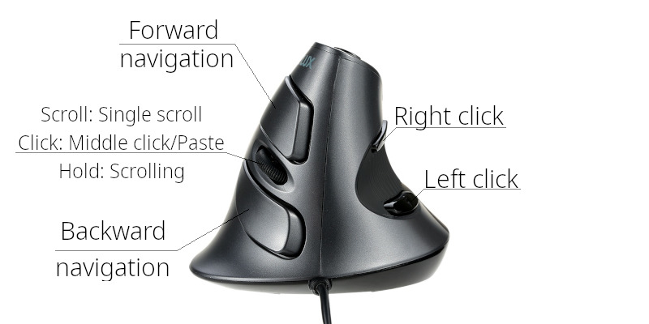

# M618 linux ergonomic button mapping

Linux custom `xinput` re-mapping for more ergonomic usage of the M618 vertical mouse series.

- [x] Basic re-mapping
- [x] `.xprofile` to make it work on X11 independent of desktop manager
- [x] Keep scrolling while holding middle-button
- [x] Support horizontal scrolling

## Maximum confort

If you are using a vertical mouse, chances are that you are trying to avoid [Carpal Tunnel Syndrome](https://en.wikipedia.org/wiki/Carpal_tunnel_syndrome).

By not using a traditional flat horizontal mouse, you already aleviate a lot of tension from your wrist, but that's not enough!

This M618 model comes with a traditional scroll wheel which requires still a lot of movement from your middle finger throughout a normal daily working routine.

In order to reduce as much as possible the movements of your fingers, I present a different button configuration to use alongside this nice mouse.

### Using your stronger thumb finger for left/right click

The buttons normally reserved for backward and forward navigation are now used as left and right click respectively.

### Scrolling with less effort as possible

You can still use the wheel for precise scrolling if you need, but you should avoid it.
The idea is simple: you just click and hold the middle button (wheel button) and move your mouse to scroll your content. It works for both *horizontal* and *vertical* scroll.
No more need to smash the scroll wheel thus killing your finger and forearm.

### Wheel to go back and forth

Since we don't want to lose all the original functionalities, now we map the backward and forward functionalities to the original left and right buttons respectively.

## Why this settings?

I've found these to be the easiest to work under Linux without conflicts between different programs.

Normally I use a slightly different configuration on Windows/Mac, but using proprietary software for button remapping. Unfortunately, I could not find any easy to install up-to-date Linux software with out-of-the-box support for this mouse.

Normally, I'd use the original left/right click buttons for scrolling and the wheel for back/forward functionality. Unfortunately, mouse scroll button events don't work as one would expect on `X11`. Instead of keeping the scroll button pressed and the system handling the automatic press/release cycle, as we keep the button pressed only one event is registered until we release the button. Thus, I could not find an easy way to hold and keep scrolling.

Fortunately, [`xinput`](https://linux.die.net/man/1/xinput) through [`libinput`](https://www.mankier.com/4/libinput) supports the `libinput Button Scrolling Button` **and** `libinput Scroll Method Enabled` properties. Therefore, we can set them on the mouse and enable scrolling while holding down the middle button without losing its regular functionality.